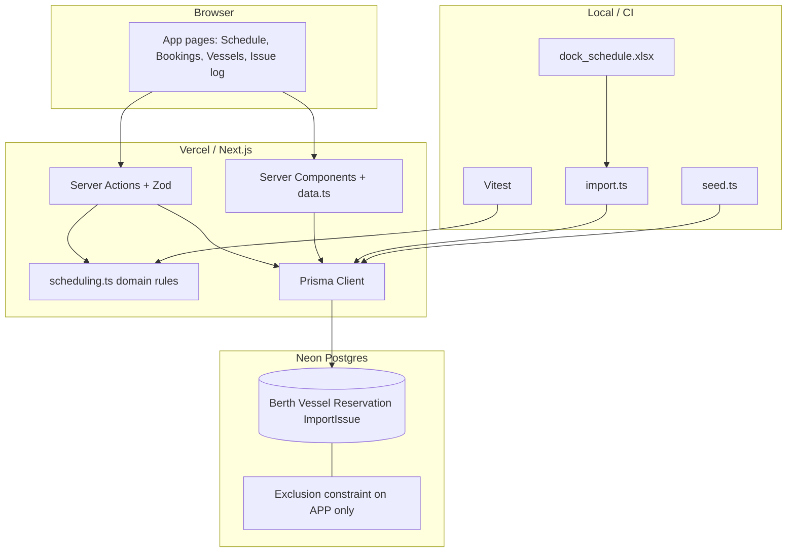

# scheDock

Dock scheduling for a marine research facility: month grid by berth, vessel directory, conflict/fit checks on new bookings, and a log of problems found in older schedule history.

**Live demo:** [sche-dock-opal.vercel.app](https://sche-dock-opal.vercel.app)

> The demo has **no auth** — treat it as a shared sandbox. Prefer creating a short test booking rather than deleting others’ data.

## Demo tour

1. **Schedule** — jump to a month in **2019** (sample history is 1997–2019; “today” may look empty).
2. Click a colored bar — past-record bookings are read-only; app bookings can be edited.
3. **New booking** — pick a vessel, enter length if needed, set dates (`M/D/YYYY`; impossible days clamp, e.g. 2/31 → 2/28).
4. **Issue log** — overlaps, missing lengths, single-day marks, and other problems from older records. New bookings are checked up front so these are harder to repeat.
5. **Vessels** — search the directory and open a vessel’s recent stays.

## Stack

Next.js (App Router) · TypeScript · Tailwind CSS · Prisma · Neon Postgres · Zod · Vitest · ExcelJS · Vercel

## Architecture



**Request path:** UI → Server Components (read) or Server Actions (write) → Zod + scheduling rules → Prisma → Neon.

**Two booking sources:** `APP` (created in the UI; blocked by app rules **and** the DB exclusion constraint) vs `IMPORT` (loaded from the sample workbook; overlaps kept and listed in the Issue log).

## Local setup

1. Copy env and fill in Neon URLs:

   ```bash
   cp .env.example .env
   ```

   | Variable | Use |
   |----------|-----|
   | `DATABASE_URL` | Pooled connection string |
   | `DIRECT_URL` | Direct / non-pooled (migrations) |

   If Neon only shows `DATABASE_URL_UNPOOLED`, put that value in `DIRECT_URL`.

2. Install, migrate, seed berths:

   ```bash
   npm install
   npx prisma migrate deploy
   npm run db:seed
   ```

3. Load sample history (recommended):

   ```bash
   npm run import
   ```

   Reads `data/dock_schedule.xlsx` (synthetic 1997–2019 workbook). Idempotent: replaces IMPORT reservations and issue-log rows.

4. Run:

   ```bash
   npm run dev
   ```

5. Tests / production build:

   ```bash
   npm test
   npm run build
   ```

## Project layout

| Area | Location |
|------|----------|
| Domain rules (pure) | `src/lib/scheduling.ts` |
| Unit tests | `src/lib/scheduling.test.ts`, `src/lib/dates.test.ts` |
| Zod schemas | `src/lib/validators.ts` |
| Server actions | `src/lib/actions.ts` |
| Data loaders | `src/lib/data.ts` |
| Prisma schema | `prisma/schema.prisma` |
| History loader CLI | `scripts/import.ts` |
| UI | `src/app/*`, `src/components/*` |

**APP bookings** are validated in app code and at the DB with a Postgres exclusion constraint (`btree_gist` + inclusive `daterange`) that applies only where `source = 'APP'`. Past-record (`IMPORT`) overlaps stay visible in the schedule and Issue log instead of being rejected by the constraint.

## Design decisions

1. **Whole-berth occupancy** — one reservation fills the berth for its days (no side-by-side packing by length).
2. **Inclusive dates** — a stay ending on day X conflicts with one starting on day X.
3. **Single-day marks** — a lone day in older grids is stored as one day and noted in the Issue log; records may not say if a longer stay was meant.
4. **LOA precedence** — if name length and an `LOA: N'` note disagree, keep LOA and log a discrepancy.
5. **Events** — no length check; vessels must fit the berth.
6. **No auth** in this MVP.

## Known limitations

- Sample history ends in 2019; opening the current month can look empty until you jump back.
- Many vessels lack length → many “unknown length” log entries.
- Month grid can feel dense on small screens.
- No roles, audit log, or export yet.

## What I’d do next

- Auth / roles (dock ops vs read-only)
- Side-by-side berth packing by remaining length
- Draft / beam constraints
- Recurring events and multi-berth holds
- Audit log and CSV / iCal export

## Deploy (Vercel)

Set `DATABASE_URL` and `DIRECT_URL` in the project env. Build runs migrate + Next build via `vercel.json`:

```bash
prisma generate && prisma migrate deploy && next build
```

After the first deploy, run `npm run import` once against production credentials if you want the sample history on the live site.
